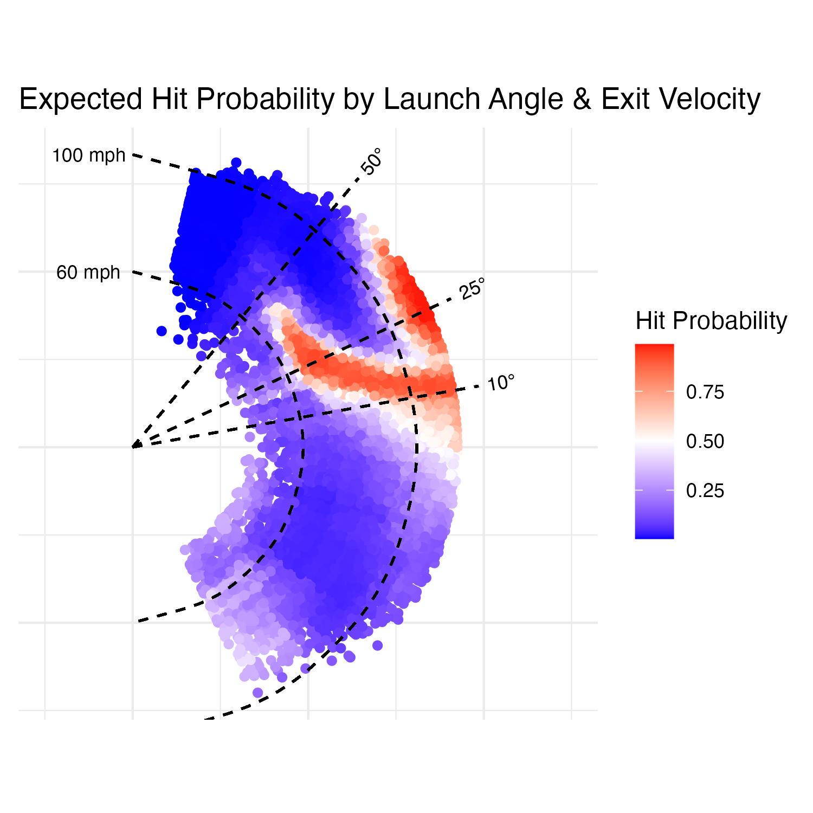

# xStats: Expected Baseball Statistics Engine

**Building the foundation for comprehensive expected statistics using Statcast data to evaluate player performance independent of luck and defensive positioning.**

## Overview

This project establishes the core infrastructure for calculating expected baseball statistics (xStats) by modeling the fundamental relationship between batted ball characteristics and outcomes. The initial model predicts hit probability based solely on launch angle and exit velocity, serving as the backbone for more sophisticated expected metrics like xBA (expected batting average), xSLG (expected slugging), and xwOBA.

**Current Model Performance:**
- **Hit Probability Model**: 0.868 AUC
- **Inputs**: Launch angle, exit velocity
- **Output**: Expected probability of any batted ball becoming a hit

## The xStats Philosophy

Expected statistics remove luck and defensive positioning from performance evaluation, revealing a player's "true" offensive contribution. By modeling what *should* happen based on batted ball quality, we can:

- Identify players who are over/under-performing their expected output
- Predict future performance regression or improvement
- Evaluate offensive contributions independent of team defensive quality
- Build more stable metrics for player valuation and projection

## Business Applications

### Player Evaluation
- **Prospect Assessment**: Identify minor leaguers with major league-quality contact despite poor results
- **Trade Analysis**: Distinguish between players experiencing bad luck vs. declining skills
- **Contract Negotiations**: Value players based on process rather than just outcomes

### Strategic Insights
- **Lineup Optimization**: Place players in situations that maximize their expected production
- **Defensive Positioning**: Understand where hits are most likely for different batted ball profiles
- **Pitching Strategy**: Identify pitch types that generate weak contact patterns

## Model Architecture

### Current Implementation: Hit Probability Model
The foundation model uses a binary classification approach:
- **Target Variable**: Hit (1) vs. Out (0) on batted balls
- **Features**: Launch angle (degrees), exit velocity (mph)
- **Rationale**: These two metrics capture the essential physics of batted ball success

### Planned Extensions
This core model will be expanded to predict:
- **Hit Type Classification**: Single, double, triple, home run probabilities
- **xwOBA Components**: Expected weighted on-base average calculations
- **Situational Models**: Context-dependent expected outcomes
- **Pitcher-Specific xStats**: Expected statistics against different pitch types

## Methodology

### Data Collection
- **Source**: MLB Statcast data via `baseballr` R package
- **Scope**: All batted balls with measured launch angle and exit velocity
- **Features**: Launch angle (degrees), exit velocity (mph)

### Model Validation
- Comprehensive train/test split methodology
- Cross-validation to ensure model stability

## Model Performance

The foundation model achieves strong predictive performance using only **two input variables**:

| Metric | Value | Interpretation |
|--------|-------|---------------|
| ROC AUC | 0.868 | Excellent discrimination with minimal features |
| Log Loss | 0.415 | Well-calibrated probabilities |
| Precision | 83.6% | High accuracy for predicted hits |



**Key Achievement**: This performance demonstrates that launch angle and exit velocity capture the essential physics of batted ball success, providing a robust foundation for more complex expected statistics.

**Current Model Performance:**
- **Model Performance**: 0.868 AUC with well-calibrated probabilities
- **Hit Prediction Accuracy**: 83.6% precision on called hits
- **Suitable for**: Expected statistics calculations and player evaluation

## Key Insights

- **Sweet Spot Identification**: Optimal launch angle ranges for different exit velocities
- **Velocity Thresholds**: Minimum exit velocity requirements for different hit types
- **Physics Validation**: Model predictions align with known baseball physics principles

## Technologies Used

- **R** - Primary analysis and modeling language
- **baseballr** - Statcast data acquisition and MLB data access
- **tidyverse** - Data manipulation and cleaning (dplyr, tidyr, readr)
- **tidymodels** - Machine learning workflow and model validation framework
- **ggplot2** - Data visualization and model diagnostic plotting

## Getting Started

### Prerequisites
```r
devtools::install_github("BillPetti/baseballr")
install.packages(c("tidyverse", "tidymodels", "DBI", "RPostgreSQL", "RPostgres", "data.table", "ggplot2", "xgboost"))
```

### Usage
1. **Data Collection**: Execute scripts in `Data/` to pull Statcast batted ball data
2. **Model Training**: Run modeling pipeline in `Modeling/` folder
3. **Generate Predictions**: Apply trained model to new batted ball events
4. **Extend Framework**: Use core model as foundation for additional xStats

## Roadmap

### Phase 1: Foundation ✅
- Hit probability model (current implementation)
- Basic data pipeline and validation framework

### Phase 2: Hit Type Classification
- Multi-class model for single/double/triple/home run prediction
- Expected slugging percentage calculations

### Phase 3: Advanced xStats
- Expected weighted on-base average (xwOBA)
- Expected weighted runs created plus (xwRC+)
- Situational and context-dependent models
- Player-level aggregation and ranking systems

## Impact & Applications

This framework enables sophisticated player evaluation that goes beyond traditional statistics. By understanding what *should* happen based on contact quality, teams can make better decisions about player acquisition, development, and strategic deployment.

The modular design allows for rapid iteration and expansion as new analytical questions arise, making it a valuable foundation for any baseball analytics operation.

---
*Building the next generation of baseball analytics through physics-based expected statistics modeling.*
